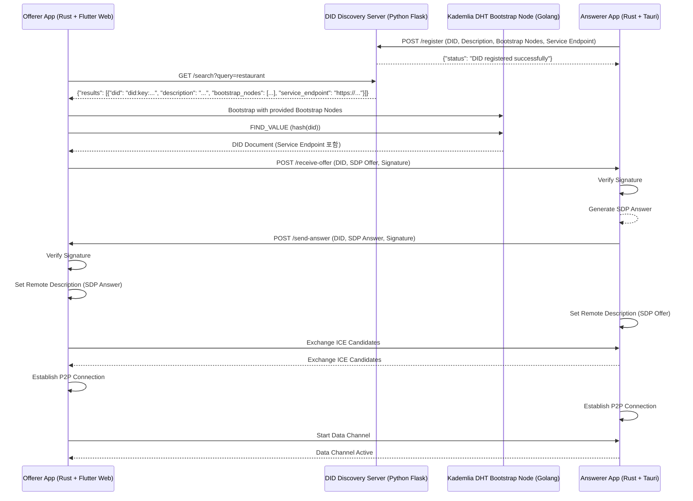

안녕하세요!

지금까지 논의된 내용을 체계적으로 정리하여 시스템의 전체적인 구조와 각 구성 요소의 역할, 기술 선택의 이유, 그리고 제안된 개선 사항을 한눈에 파악할 수 있도록 도와드리겠습니다.

---

## **목차**

1. [시스템 개요](#1-시스템-개요)
2. [주요 구성 요소 및 기술 스택](#2-주요-구성-요소-및-기술-스택)
    - [DID Discovery Server: Python Flask](#diddiscovery-server-python-flask)
    - [Kademlia DHT Bootstrap Node: Golang](#kademlia-dht-bootstrap-node-golang)
    - [Offerer App: Rust (WebAssembly) + Flutter Web](#offerer-app-rust-webassembly--flutter-web)
    - [Answerer App: Rust (Tauri)](#answerer-app-rust-tauri)
3. [구성 요소 간 상호 작용](#3-구성-요소-간-상호-작용)
4. [제안된 개선 사항](#4-제안된-개선-사항)
5. [보안 및 성능 고려사항](#5-보안-및-성능-고려사항)
6. [개발 및 운영 권장 사항](#6-개발-및-운영-권장-사항)
7. [결론](#7-결론)

---

## **1. 시스템 개요**

본 시스템은 **DID (Decentralized Identifier)** 기반으로 **Offerer**와 **Answerer** 간에 **WebRTC P2P 통신**을 설정하는 것을 목표로 합니다. 이를 위해 **DID Discovery Server**, **Kademlia DHT 네트워크**, **시그널링 HTTP 서버**, **WebRTC**, **암복호화 모듈**, 그리고 **사용자 인터페이스**를 포함한 다양한 구성 요소가 사용됩니다.

---

## **2. 주요 구성 요소 및 기술 스택**

### **DID Discovery Server: Python Flask**

- **역할**: 특정 카테고리(예: "restaurant")를 기반으로 DID를 검색하고, 관련된 DID 리스트와 설명을 제공합니다.
- **기술 선택 이유**:
  - **빠른 개발 속도**: Flask는 경량 웹 프레임워크로, 빠르게 API를 개발하고 배포할 수 있습니다.
  - **풍부한 생태계**: Python의 방대한 라이브러리와 도구들을 활용할 수 있습니다.
- **장단점**:
  - **장점**: 유연성, 빠른 프로토타이핑.
  - **단점**: 높은 트래픽 처리 시 성능 저하 가능성, 비동기 처리의 제한.

### **Kademlia DHT Bootstrap Node: Golang**

- **역할**: DID Document를 분산 저장 및 검색하는 Kademlia DHT 네트워크의 부트스트랩 노드를 제공합니다.
- **기술 선택 이유**:
  - **높은 성능**: Golang은 컴파일된 언어로, 높은 처리 속도와 낮은 지연 시간을 제공합니다.
  - **병렬 처리**: 고루틴을 통한 효율적인 병렬 처리가 가능합니다.
- **장단점**:
  - **장점**: 성능, 병렬 처리 효율성, 배포 용이성.
  - **단점**: 개발 생산성, 상대적으로 작은 에코시스템.

### **Offerer App: Rust (WebAssembly) + Flutter Web**

- **Rust (WebAssembly)**:
  - **역할**: 고성능의 암복호화 작업 및 기타 계산 집약적인 로직을 처리합니다.
  - **장점**: 메모리 안전성, 높은 성능, WebAssembly 지원.
  - **단점**: 복잡성, 학습 곡선.
  
- **Flutter Web**:
  - **역할**: 사용자 인터페이스(UI)와 통신을 담당합니다.
  - **장점**: 크로스 플랫폼, 풍부한 위젯, 빠른 개발.
  - **단점**: 성능 최적화 필요, 초기 로드 시간.

### **Answerer App: Rust (Tauri)**

- **역할**: 시그널링 HTTP 서버를 실행하여 SDP Offer를 수신하고 SDP Answer를 제공합니다.
- **기술 선택 이유**:
  - **높은 성능과 보안**: Rust의 메모리 안전성과 Tauri의 경량화.
  - **크로스 플랫폼 지원**: Windows, macOS, Linux 등 다양한 플랫폼에서 실행 가능.
- **장단점**:
  - **장점**: 성능, 보안, 경량화.
  - **단점**: 개발 복잡성, 상대적으로 작은 에코시스템.

---

## **3. 구성 요소 간 상호 작용**

1. **Answerer 준비**:
   - DID Discovery Server에 자신의 DID와 부트스트랩 노드 정보를 등록.
   - 시그널링 HTTP 서버(Tauri)를 실행하여 SDP Offer를 수신하고 SDP Answer를 제공합니다.
   - Kademlia DHT 네트워크에 자신의 DID Document를 저장합니다.

2. **Offerer의 연결 요청**:
   - DID Discovery Server를 통해 원하는 카테고리(예: "restaurant")에 속하는 DID 검색.
   - 선택한 DID의 부트스트랩 노드 정보를 포함한 DID Document를 Kademlia DHT에서 조회.
   - WebRTC를 사용하여 SDP Offer를 생성하고, Rust (WebAssembly) 모듈을 통해 암호화 후, Flutter Web을 통해 Answerer의 시그널링 서버로 전송.
   - SDP Answer를 수신하고, 서명을 검증한 후 WebRTC 연결을 설정.

3. **WebRTC 연결 설정**:
   - ICE 후보지 교환을 통해 최적의 P2P 경로 설정.
   - DTLS 핸드셰이크를 통해 보안 연결 확립.
   - 데이터 채널을 통해 P2P 통신 시작.

---

## **4. 제안된 개선 사항**

**Answerer가 부트스트랩 노드 정보를 DID Discovery Server에 함께 등록**함으로써, **Offerer가 DHT에서 Answerer의 DID를 더 쉽게 찾을 수 있도록** 하는 방안을 제안하셨습니다. 이는 다음과 같은 장점을 제공합니다:

- **검색 효율성 향상**: Offerer는 DID Discovery Server를 통해 부트스트랩 노드 정보를 함께 받아 DHT 네트워크에 더 빠르게 접근할 수 있습니다.
- **신뢰성과 안정성 강화**: 부트스트랩 노드의 정보를 제공함으로써, Offerer가 안정적인 노드에 접속할 가능성이 높아집니다.
- **유연성 증대**: 다양한 메타데이터를 제공하여 Offerer가 더 많은 정보를 바탕으로 원하는 Answerer를 선택할 수 있습니다.

---

## **5. 보안 및 성능 고려사항**

### **보안 강화**

- **암호화된 통신**: 모든 통신은 TLS를 통해 암호화되어야 합니다.
- **디지털 서명 검증**: 모든 시그널링 메시지(SDP Offer/Answer)는 ED25519 서명을 통해 무결성과 신뢰성을 검증해야 합니다.
- **키 관리**: Private Key는 안전하게 보관되고, Public Key는 DID Document를 통해 신뢰성 있게 배포되어야 합니다.
- **API 인증**: 시그널링 HTTP 서버의 API 접근은 인증 토큰이나 API 키로 제한하여 비인가 접근을 방지해야 합니다.

### **성능 최적화**

- **Kademlia DHT 네트워크**: 부트스트랩 노드의 신뢰성과 성능을 보장하여 네트워크 탐색 시간을 단축합니다.
- **WebAssembly 모듈 최적화**: Rust로 작성된 WebAssembly 모듈의 크기와 성능을 최적화하여 초기 로드 시간을 줄입니다.
- **Flutter Web 최적화**: Flutter Web의 렌더링 성능을 지속적으로 테스트하고 최적화합니다.

---

## **6. 개발 및 운영 권장 사항**

### **기술 복잡성 관리**

- **모듈화된 아키텍처**: 각 구성 요소를 독립적인 서비스로 모듈화하여 관리하고, 상호 의존성을 최소화합니다.
- **문서화**: API 명세서, 아키텍처 다이어그램 등을 철저히 문서화하여 팀 간 협업을 원활하게 합니다.

### **개발자 역량 강화**

- **Rust, WebAssembly, Tauri 학습**: 팀 내 개발자들이 Rust와 WebAssembly, Tauri에 대한 충분한 지식을 갖추도록 교육과 코드 리뷰를 실시합니다.

### **자동화 및 CI/CD**

- **컨테이너화**: Docker와 같은 컨테이너 기술을 사용하여 각 서비스의 배포를 자동화합니다.
- **CI/CD 파이프라인 구축**: GitHub Actions, GitLab CI 등을 활용하여 빌드, 테스트, 배포 과정을 자동화합니다.

### **모니터링 및 로깅**

- **시스템 모니터링**: Prometheus, Grafana 등을 사용하여 시스템 상태를 실시간으로 모니터링합니다.
- **에러 로깅**: Sentry와 같은 도구를 활용하여 에러를 실시간으로 추적하고 분석합니다.

---

## **7. 결론**

제시된 **개발 도구 스택**은 각 구성 요소의 역할과 요구사항을 충족시키기 위해 신중하게 선택된 것으로 보입니다. **Python Flask**는 빠른 웹 서비스 개발에 적합하고, **Golang**은 고성능의 DHT 네트워크 구축에 이상적입니다. **Rust (WebAssembly)**와 **Flutter Web**의 조합은 **고성능 암복호화**와 **유연한 사용자 인터페이스**를 제공하며, **Rust (Tauri)**는 **보안이 강화된 데스크톱 애플리케이션**을 가능하게 합니다.

### **핵심 장점:**

- **성능**: Golang과 Rust는 고성능과 안정성을 보장합니다.
- **보안**: Rust의 메모리 안전성과 ED25519 디지털 서명을 통한 보안 강화.
- **유연성**: Flutter Web과 Tauri를 통한 크로스 플랫폼 지원 및 풍부한 UI 제공.

### **도전 과제 및 권장 사항:**

- **기술 복잡성 관리**: 다양한 언어와 프레임워크를 사용하는 만큼, 개발과 유지보수의 복잡성을 줄이기 위해 모듈화된 아키텍처와 철저한 문서화가 필요합니다.
- **보안 강화**: 모든 통신을 암호화하고, 디지털 서명을 통해 데이터의 무결성과 신뢰성을 확보해야 합니다.
- **성능 최적화**: 각 구성 요소의 성능을 지속적으로 모니터링하고 최적화하여, 사용자 경험을 향상시킵니다.
- **자동화된 빌드 및 배포**: CI/CD 파이프라인을 구축하여 일관된 배포 프로세스를 유지합니다.

### **최종 결론:**

제안된 기술 스택과 아키텍처는 **안정적이고 효율적인 P2P 통신 시스템**을 구축하는 데 적합하며, **보안과 성능** 측면에서 강점을 가지고 있습니다. 다만, **기술 복잡성**과 **개발자 역량**에 대한 지속적인 관리와 강화가 필요합니다. 이를 통해 성공적인 프로젝트 구현이 가능할 것입니다.

---

이 다이어그램은 **Offerer**, **DID Discovery Server**, **Kademlia DHT**, **Answerer** 간의 상호 작용을 시각적으로 표현한 것입니다. 이를 통해 전체 통신 흐름을 명확히 이해할 수 있습니다.

아래는 **Mermaid** 문법을 사용한 시퀀스 다이어그램 코드입니다. 이 코드를 [Mermaid Live Editor](https://mermaid.live/)나 다른 Mermaid 지원 도구에 붙여넣으면 다이어그램을 시각적으로 확인할 수 있습니다.

### **다이어그램 설명**

1. **Answerer의 DID 등록 과정**
    - **Answerer App**은 자신의 DID, 설명, 부트스트랩 노드 정보, 서비스 엔드포인트를 **DID Discovery Server**에 `POST /register` 요청을 통해 등록합니다.
    - **DID Discovery Server**는 등록 성공 메시지를 **Answerer App**에 응답합니다.

2. **Offerer의 DID 검색**
    - **Offerer App**은 **DID Discovery Server**에 `GET /search?query=restaurant` 요청을 보내 특정 카테고리에 속하는 DID 리스트와 메타데이터를 검색합니다.
    - **DID Discovery Server**는 검색 결과로 DID, 설명, 부트스트랩 노드 정보, 서비스 엔드포인트를 **Offerer App**에 응답합니다.

3. **Offerer의 DHT 접속 및 DID Document 조회**
    - **Offerer App**은 받은 부트스트랩 노드 정보를 사용하여 **Kademlia DHT Bootstrap Node**에 접속합니다.
    - **Offerer App**은 특정 DID의 해시 키를 생성하고, `FIND_VALUE` 요청을 통해 해당 DID의 DID Document를 조회합니다.
    - **Kademlia DHT Bootstrap Node**는 DID Document를 **Offerer App**에 반환합니다.

4. **Offerer의 SDP Offer 생성 및 전송**
    - **Offerer App**은 WebRTC API를 사용하여 SDP Offer를 생성하고, Rust (WebAssembly) 모듈을 통해 암호화 및 서명합니다.
    - **Flutter Web**을 통해 서명된 SDP Offer와 함께 **Answerer App**의 시그널링 HTTP 서버 (`POST /receive-offer`)로 전송합니다.

5. **Answerer의 SDP Offer 수신 및 검증**
    - **Answerer App**은 **Offerer App**으로부터 받은 SDP Offer의 서명을 검증합니다.
    - 서명이 유효하다면, SDP Answer를 생성하고 서명합니다.

6. **Answerer의 SDP Answer 전송**
    - **Answerer App**은 서명된 SDP Answer를 **Offerer App**의 시그널링 HTTP 서버 (`POST /send-answer`)로 전송합니다.

7. **Offerer의 SDP Answer 수신 및 검증**
    - **Offerer App**은 **Answerer App**으로부터 받은 SDP Answer의 서명을 검증합니다.
    - 서명이 유효하다면, WebRTC 연결을 설정합니다.

8. **WebRTC 연결 설정**
    - **Offerer App**과 **Answerer App**은 SDP Offer/Answer를 설정하고, ICE 후보지를 교환하여 최적의 P2P 경로를 설정합니다.
    - DTLS 핸드셰이크를 통해 보안 연결을 확립하고, 데이터 채널을 통해 P2P 연결을 활성화합니다.

9. **데이터 전송 시작**
    - **Offerer App**과 **Answerer App**은 데이터 채널을 통해 직접 데이터를 주고받기 시작합니다.

### **기술 스택 요약**

- **DID Discovery Server**: Python Flask
- **Kademlia DHT Bootstrap Node**: Golang
- **Offerer App**:
  - **백엔드 로직**: Rust (WebAssembly) - 암복호화
  - **프론트엔드**: Flutter Web - UI 및 통신
- **Answerer App**: Rust (Tauri) - 시그널링 HTTP 서버