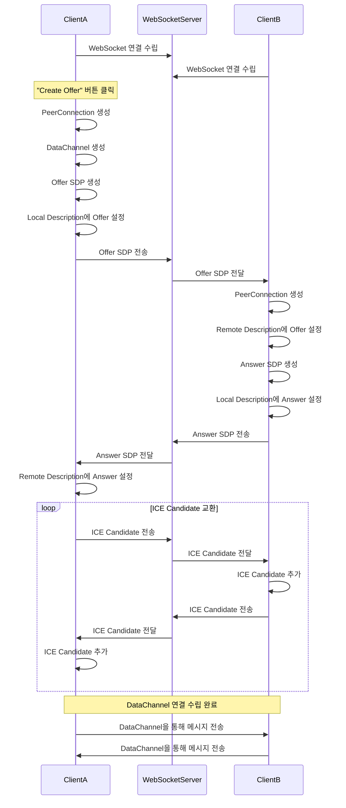

# scratch_pjt
WebRTC 연결 과정에서의 SDP 교환 절차를 포함한 상세한 흐름을 Mermaid 시퀀스 다이어그램으로 정리해드리겠습니다.



위 다이어그램은 WebRTC를 이용한 텍스트 채팅 앱에서의 상세한 절차를 나타냅니다. 각 단계는 다음과 같습니다:

1. **WebSocket 연결 수립**: ClientA와 ClientB 모두 WebSocket 서버에 연결합니다.
2. **Offer 생성 및 전송 (ClientA)**:
   - "Create Offer" 버튼을 클릭하여 PeerConnection과 DataChannel을 생성합니다.
   - Offer SDP를 생성하고 Local Description에 설정합니다.
   - WebSocket 서버를 통해 Offer SDP를 ClientB에게 전송합니다.
3. **Offer 수신 및 Answer 생성 (ClientB)**:
   - Offer SDP를 수신하고 Remote Description에 설정합니다.
   - PeerConnection을 생성하고 Answer SDP를 생성합니다.
   - Local Description에 Answer SDP를 설정하고 WebSocket 서버를 통해 ClientA에게 전송합니다.
4. **Answer 수신 및 설정 (ClientA)**:
   - Answer SDP를 수신하고 Remote Description에 설정합니다.
5. **ICE Candidate 교환**:
   - 양측 클라이언트는 ICE Candidate를 생성할 때마다 WebSocket 서버를 통해 상대방에게 전달합니다.
   - 수신한 ICE Candidate를 PeerConnection에 추가합니다.
6. **DataChannel을 통한 통신 시작**:
   - 모든 신호 교환이 완료되면 DataChannel이 열리고, 실시간으로 메시지를 주고받을 수 있습니다.

이러한 절차를 통해 두 클라이언트는 직접 통신할 수 있는 WebRTC 연결을 설정하고, 텍스트 채팅을 구현하게 됩니다.
# change-ledger-ui

Flutter 앱과 WebSocket 서버를 빌드하고 실행하는 방법 및 테스트 절차를 정리해드리겠습니다.

## 사전 준비

- **Python 3.7 이상**이 설치되어 있어야 합니다.
- **Flutter SDK**가 설치되어 있어야 합니다.
- **Dart SDK**는 Flutter에 포함되어 있습니다.
- **패키지 매니저**(예: `pip` 또는 `pipenv`)가 필요합니다.

## 서버 설정 및 실행 방법

1. **필요한 Python 패키지 설치**

   `server.py`를 실행하기 전에 필요한 패키지를 설치해야 합니다. 터미널 또는 명령 프롬프트에서 다음 명령어를 실행하세요:

   ```bash
   pip install websockets asyncio logging
   ```

2. **서버 실행**

   `server.py` 파일이 있는 디렉토리로 이동한 다음, 다음 명령어를 실행하여 서버를 시작합니다:

   ```bash
   python server.py
   ```

   서버가 성공적으로 실행되면 로그에 다음과 같은 메시지가 표시됩니다:

   ```
   WebSocket server is running on ws://localhost:3000
   ```

## Flutter 앱 빌드 및 실행 방법

1. **Flutter 프로젝트 설정**

   `main.dart` 파일을 새로운 Flutter 프로젝트에 추가해야 합니다.

   ```bash
   flutter create webrtc_text_chat
   cd webrtc_text_chat
   ```

   생성된 프로젝트의 `lib` 디렉토리에 있는 `main.dart` 파일을 제공된 `main.dart` 내용으로 대체합니다.

2. **의존성 추가**

   `pubspec.yaml` 파일에 필요한 패키지를 추가합니다:

   ```yaml
   dependencies:
     flutter:
       sdk: flutter
     flutter_webrtc: ^0.8.0
     web_socket_channel: ^2.1.0
   ```

   그리고 패키지를 업데이트합니다:

   ```bash
   flutter pub get
   ```

3. **iOS 및 Android 설정 (필요한 경우)**

   - **iOS**: `ios/Runner/Info.plist` 파일에 권한 설정을 추가해야 할 수 있습니다.
   - **Android**: `android/app/src/main/AndroidManifest.xml` 파일에 인터넷 권한을 확인하세요.

4. **Flutter 앱 실행**

   에뮬레이터나 실제 기기에서 앱을 실행합니다:

   ```bash
   flutter run
   ```

   두 개의 기기나 에뮬레이터에서 앱을 실행하여 서로 채팅할 수 있습니다.

## 테스트 방법

1. **서버 실행 확인**

   앞서 설명한 대로 `server.py`를 실행하여 WebSocket 서버가 실행 중인지 확인합니다.

2. **앱 실행 및 Offer 생성**

   한 대의 기기에서 앱을 실행하고 **"Create Offer"** 버튼을 눌러 Offer를 생성합니다. 이는 해당 기기가 연결을 시작하도록 합니다.

3. **다른 기기에서 앱 실행**

   두 번째 기기에서 앱을 실행합니다. 이 기기는 Offer를 수신하고 자동으로 Answer를 생성합니다.

4. **메시지 전송 테스트**

   각 기기의 텍스트 필드에 메시지를 입력하고 전송 버튼을 눌러 메시지가 상대방 기기에 전달되는지 확인합니다.

## 추가 고려 사항

- **WebSocket 서버 주소 수정**

  `main.dart`에서 WebSocket 서버의 주소가 `ws://localhost:3000`으로 설정되어 있습니다. 실제 기기에서 테스트하는 경우, 서버가 실행 중인 PC의 IP 주소로 변경해야 합니다.

  ```dart
  final _channel = IOWebSocketChannel.connect('ws://YOUR_PC_IP_ADDRESS:3000');
  ```

- **방화벽 및 네트워크 설정**

  서버와 클라이언트가 동일한 네트워크 내에 있어야 하며, 방화벽이 해당 포트를 허용하도록 설정되어 있어야 합니다.

- **ICE 서버 설정**

  NAT 환경에서 동작하려면 STUN/TURN 서버를 설정해야 합니다. 현재 코드에서 ICE 서버 설정은 주석 처리되어 있습니다. 필요에 따라 주석을 해제하고 적절한 ICE 서버를 설정하세요.

  ```dart
  final Map<String, dynamic> config = {
    'iceServers': [
      {'urls': 'stun:stun.l.google.com:19302'}
    ]
  };
  ```

## Getting Started

This project is a starting point for a Flutter application.

A few resources to get you started if this is your first Flutter project:

- [Lab: Write your first Flutter app](https://docs.flutter.dev/get-started/codelab)
- [Cookbook: Useful Flutter samples](https://docs.flutter.dev/cookbook)

For help getting started with Flutter development, view the
[online documentation](https://docs.flutter.dev/), which offers tutorials,
samples, guidance on mobile development, and a full API reference.
