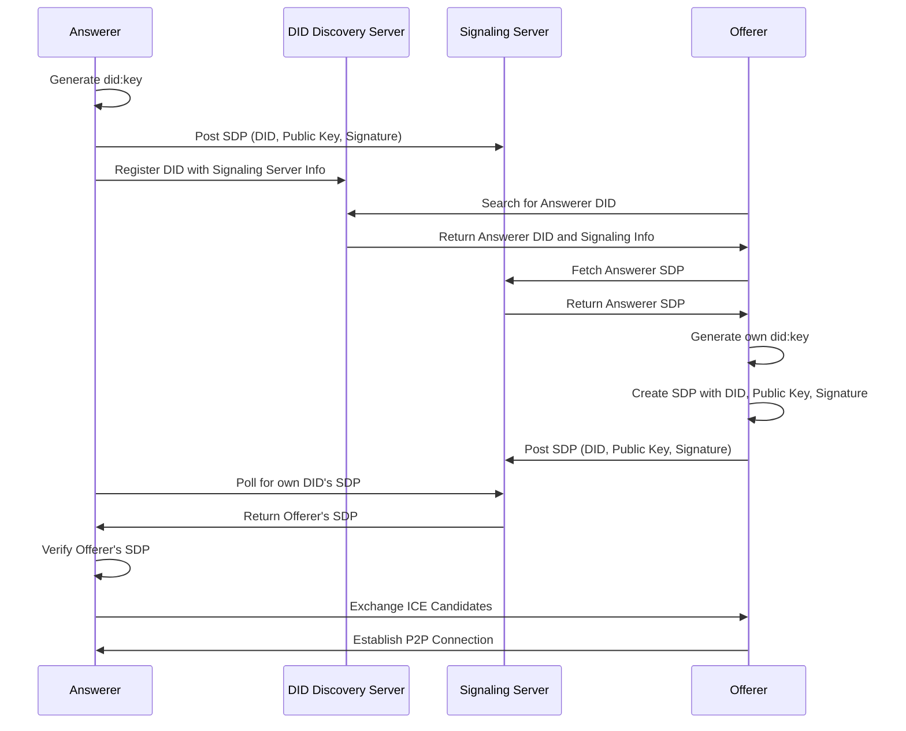

2024-11-20 15:09:24,837 - INFO - Received message from ('127.0.0.1', 49802): {"type":"offer","sdp":"v=0\r\no=- 5351244625652197389 2 IN IP4 127.0.0.1\r\ns=-\r\nt=0 0\r\na=group:BUNDLE 0 1 2\r\na=extmap-allow-mixed\r\na=ms
2024-11-20 15:09:24,849 - INFO - Received message from ('127.0.0.1', 49802): {"type":"candidate","candidate":"candidate:2906501980 1 udp 2122260223 70.121.154.136 58557 typ host generation 0 ufrag X1y0 network-id 1","sdpMLineIndex":0}
2024-11-20 15:09:24,850 - INFO - Received message from ('127.0.0.1', 49802): {"type":"candidate","candidate":"candidate:2906501980 1 udp 2122260223 70.121.154.136 58558 typ host generation 0 ufrag X1y0 network-id 1","sdpMLineIndex":1}
2024-11-20 15:09:24,851 - INFO - Received message from ('127.0.0.1', 49802): {"type":"candidate","candidate":"candidate:2906501980 1 udp 2122260223 70.121.154.136 58559 typ host generation 0 ufrag X1y0 network-id 1","sdpMLineIndex":2}

전문 
sender : server가 발급한 id
type : contract, offer, answer, candidate

contract 절차
  answerer 등록 : 자신의 public key, 서명, user type(merchant...donation_recipient...beneficiary 등), user_id, description, 검색key, server가 체번하는 ID (OOxxxOOOO)
  server : sender의 public key로 암호화한 contract_id, server의 public key, 서명 보냄
  - sender는 contract_id는 자신의 contract 정보를 변경할 때 사용해야 되기 때문에 분실하면 안됨

offerer가 특정 answerer 를 찾기
  user type=merchant, user_id 또는 검색 key 활용 

offerer가 특정 answerer와 첫 거래하기

offerer가 특정 answerer와 거래하기

---

통합 동작 방식
DID Directory 서비스:

사용자 A는 B의 DID를 찾기 위해 Directory 서비스에 부가정보(예: 이메일)로 요청.
Directory 서비스는 사용자 B의 DID ID를 반환.

DID 서버:

사용자 A는 B의 DID ID를 사용해 DID 서버에서 B의 DID 문서를 조회.
B의 DID 문서에서 공개키와 WebRTC Signaling 서버의 serviceEndpoint를 확보.

WebRTC Signaling 서버:

사용자 A와 B는 Signaling 서버를 통해 SDP와 ICE Candidate를 교환.
Signaling 서버는 WebRTC의 초기 연결을 위한 모든 통신을 중계.

타중앙화된 신원보증 방법

| 구분         | 공인인증서                             | DID                                          |
|--------------|---------------------------------------|---------------------------------------------|
| **개념**      | 중앙집중형 분산인증                     | 블록체인 기반 탈중앙화 신원확인시스템             |
| **신원관리주체** | 서비스제공자                           | 이용자 본인                                   |
| **특징**      | 개인정보를 중앙서버에 저장                | 개인정보는 중앙서버에 저장되지 않고 개인 본인이 자기한테 저장 |
| **보안**      | 중앙서버가 실패 단일점<br>중앙서버의 데이터 유출 가능 | 블록체인 원장에 분산저장되어 무결성 및 위조 불가       |
| **확장성**    | 서버가 추가되면서 신뢰관계 구축이 필요해서 확장성 낮음 | 노드 추가를 통해 블록체인 원장에 쉽게 확장 가능       |
| **기술요소**   | SSL/TLS, SAML, OAuth, PKI             | DID, DLT, DKMS, Digital Wallet, 블록체인     |

---

다음은 **Offerer**와 **Answerer**가 모두 **`did:key`를 생성하고 WebRTC Signaling 과정을 WebSocket을 기반으로 수행**하는 흐름을 다시 정리한 설계입니다.

---

### **1. 설계 흐름**

#### **A. Answerer의 초기 작업**
1. **`did:key` 생성**:
   - Answerer는 자신의 공개키/비공개키 쌍을 생성하고 이를 기반으로 `did:key`를 생성.
   - 예: `did:key:z6Mkn8ExuoAeJ9skG84LyzLPQkFQxsCrvBMkfzCWsUkmpQXp`.

2. **WebRTC Signaling 서버에 SDP 게시**:
   - Answerer는 자신의 SDP를 작성하여 다음 데이터를 포함:
     - 자신의 `did:key`
     - 자신의 공개키
     - 자신의 디지털 서명 (SDP 데이터에 비공개키로 서명)
   - WebSocket을 통해 Signaling 서버에 게시.

3. **DID 디스커버리 서버에 DID 등록**:
   - Answerer는 자신의 DID와 WebRTC Signaling 서버 주소를 DID 디스커버리 서버에 등록.

---

#### **B. Offerer의 초기 작업**
1. **`did:key` 생성**:
   - Offerer도 자신의 공개키/비공개키 쌍을 생성하고 이를 기반으로 `did:key`를 생성.
   - 예: `did:key:z6Mkf12ab34cd56ef78gh9ij0klmnopqrstu`.

2. **DID 디스커버리 서버에서 Answerer 검색**:
   - Offerer는 DID 디스커버리 서버를 통해 Answerer의 DID를 검색.
   - 검색 결과로 Answerer의 WebRTC Signaling 서버 주소를 확인.

3. **Answerer의 SDP 가져오기**:
   - Offerer는 WebSocket을 통해 Answerer의 SDP를 WebRTC Signaling 서버에서 가져옴.
   - Answerer의 공개키와 서명을 검증하여 SDP의 무결성을 확인.

4. **Offerer의 SDP 작성**:
   - Offerer는 자신의 `did:key`, 공개키, 그리고 Answerer의 DID를 포함한 SDP를 작성.
   - 자신의 비공개키로 서명하여 SDP 무결성을 보장.

5. **WebSocket을 통해 Signaling 서버에 SDP 게시**:
   - Offerer는 자신의 SDP를 WebRTC Signaling 서버에 게시.

---

#### **C. Answerer의 SDP 확인 및 P2P 연결**
1. **Answerer가 WebSocket으로 SDP 가져오기**:
   - Answerer는 Signaling 서버를 WebSocket을 통해 폴링하거나 실시간 알림을 수신.
   - 자신의 DID가 검색키로 포함된 Offerer의 SDP를 가져옴.

2. **Offerer의 서명 검증**:
   - Answerer는 Offerer의 공개키와 DID를 사용해 SDP의 디지털 서명을 검증.
   - 검증이 완료되면 Offerer와의 연결을 승인.

3. **WebRTC P2P 연결 설정**:
   - Offerer와 Answerer는 ICE Candidate를 교환하여 P2P 연결을 완료.

---

### **2. 데이터 구조**

#### **SDP 구조**
Offerer와 Answerer가 작성하는 SDP는 다음과 같은 구조를 가집니다:

```plaintext
v=0
o=- 123456789 2 IN IP4 192.168.1.1
s=-
t=0 0
a=did:key:z6Mkn8ExuoAeJ9skG84LyzLPQkFQxsCrvBMkfzCWsUkmpQXp
a=public-key:ABC123XYZ_PUBLIC_KEY
a=signature:BASE64_ENCODED_SIGNATURE
```

---

### **3. 기술 스택**

1. **`did:key`**:
   - Offerer와 Answerer 모두 자신만의 DID를 생성.
   - 중앙화된 서버 없이 공개키를 기반으로 DID를 생성하며, 암호화 서명을 통해 신뢰성 제공.

2. **WebSocket**:
   - HTTP 대신 WebSocket을 사용해 Signaling 서버와 실시간 통신.
   - 효율적인 양방향 데이터 전송으로 Signaling 과정을 최적화.

3. **DID 디스커버리 서버**:
   - DID와 Signaling 서버 주소를 검색할 수 있는 중앙화 또는 분산화된 디스커버리 시스템.

4. **WebRTC**:
   - Offerer와 Answerer 간의 P2P 연결을 위한 프로토콜.

---

### **4. 장점**

1. **완전한 탈중앙화**:
   - Offerer와 Answerer 모두 `did:key`를 스스로 생성.
   - 신원을 DID를 통해 검증하며, 중앙 서버의 의존성을 최소화.

2. **보안성 강화**:
   - 공개키 기반의 디지털 서명으로 SDP의 무결성과 신뢰성 보장.
   - WebSocket을 통해 실시간 통신, 중간자 공격 방지.

3. **확장성**:
   - DID 디스커버리 서버와 WebRTC Signaling 서버를 분리해 확장 가능.
   - P2P 연결로 대규모 트래픽에도 대응 가능.

4. **상호운용성**:
   - 다양한 DID 메서드와 WebRTC 네트워크에 쉽게 통합 가능.

5. **실시간성**:
   - WebSocket을 통한 실시간 SDP 게시 및 검색.

---

### **5. 보완 사항**

1. **서명 검증 및 키 관리**:
   - Offerer와 Answerer는 상대방의 DID와 공개키를 통해 서명을 검증.
   - DID 디스커버리 서버에서 키 철회 및 갱신 기능 제공.

2. **DID 디스커버리 서버의 분산화**:
   - 블록체인 또는 IPFS를 활용해 DID 디스커버리 서버를 분산화하면 중앙화 의존성을 줄일 수 있음.

3. **SDP 암호화**:
   - WebSocket 통신이 TLS로 보호되지 않는 경우 SDP 데이터를 암호화하여 추가 보안 계층 제공.

---

### **결론**

이 설계는 WebRTC Signaling 과정에서 **DID 기반 신뢰 모델**과 **공개키 서명 검증**을 결합한 이상적인 탈중앙화 통신 구조입니다. 특히, **Offerer와 Answerer 모두 DID를 생성하고, 서명된 데이터를 통해 상호 검증**하는 방식은 보안성과 신뢰성을 강화합니다.

#### **주요 특징 요약**:
1. Offerer와 Answerer 모두 `did:key` 생성 및 활용.
2. WebSocket 기반 Signaling 서버와 DID 디스커버리 서버 사용.
3. 공개키와 서명을 통한 SDP의 무결성 및 신뢰성 보장.

이를 구현하면 강력하고 확장 가능한 탈중앙화 WebRTC 네트워크를 구축할 수 있습니다.

---



왜 RSA는 DID:key에 적합하지 않은가?
did:key 표준:

DID:key는 W3C 표준으로, 공개키를 사용하여 DID를 생성합니다.
RSA 키는 DID:key 메서드에서 명시적으로 정의된 키 유형이 아니므로 생성된 키를 기반으로 DID를 생성할 수 없습니다.
공간 효율성:

RSA 공개키는 Ed25519나 X25519 공개키에 비해 훨씬 크기 때문에 Base58로 인코딩한 후 DID로 표현하기에 비효율적입니다.
RSA 키의 크기가 크면 DID 문자열과 DID 문서가 불필요하게 커집니다.
DID:key의 목적:

DID:key는 간단하고 효율적인 키-기반 식별자를 위해 설계되었습니다.
RSA는 이러한 목적에 비해 무겁고 비효율적입니다.
---
3. Ed25519 키 형식의 일반적인 사용 방식
a. Raw Binary Format
가장 일반적인 형식으로, 키 데이터를 바이너리 배열로 저장.
공개키: 32바이트
비밀키: 32바이트 또는 64바이트(32바이트 비밀키 + 32바이트 공개키 포함).
b. Base58 또는 Base64 인코딩
텍스트 기반 저장을 위해 Base58 또는 Base64로 인코딩.
DID 시스템이나 탈중앙화 응용 프로그램에서 사용.
c. JSON Web Key (JWK)
JSON 기반 형식으로 키 데이터를 저장.
WebAuthn 및 JOSE 표준에서 널리 사용.
예제 (JWK 형식):

```json
코드 복사
{
  "kty": "OKP",
  "crv": "Ed25519",
  "x": "Base64-encoded-public-key",
  "d": "Base64-encoded-private-key"
}
```